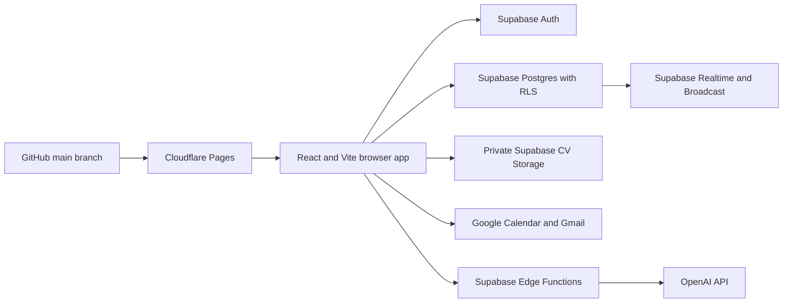

# Opportunity Desk developer handoff

This file is the starting point for the next change to Opportunity Desk. It explains what exists, why it was built this way, where to make changes, and what must be checked before merging.

Last reviewed: 3 August 2026.

## Start here for the next change

1. Read the architecture rules below. Keep React, Supabase, GitHub, and Cloudflare in their current roles.
2. Confirm whether the change needs only browser code or also a database migration or Edge Function.
3. Create a branch named `codex/<short-change-name>` from the latest `main`.
4. Preserve row-level security, multi-device synchronization, and optimistic locking.
5. Test desktop and mobile paths, including failure and retry behavior.
6. Run the verification checklist near the end of this file.
7. Open or update a pull request and address every actionable review finding.

Do not put service-role keys, OpenAI keys, Google access tokens, or other private credentials in browser code, GitHub, or Cloudflare public variables.

## Product purpose

Opportunity Desk is a private job-search workspace at `jobs.ezherebetskii.com`. A person signs in once on any device and sees the same applications, CVs, reminders, preferences, and send history. No device-specific database connection is required.

The main user journey is:

1. Find or manually add an opportunity.
2. Track it through the application pipeline.
3. Select or tailor a CV for that opportunity.
4. Schedule follow-ups and interviews.
5. Send the application through Gmail and retain synchronized history.
6. Review results and decide what to do next.

## Architecture that must remain unchanged



- **React and Vite** render the user interface.
- **Supabase Auth** owns sign-in and sessions.
- **Supabase Postgres** is the single source of truth for synchronized records.
- **Row-level security** limits every user to their own records.
- **Supabase Realtime** refreshes signed-in devices after changes.
- **Supabase Storage** keeps CV files private and separated by user folder.
- **Supabase Edge Functions** hold private third-party API keys and perform protected server work.
- **Google Identity Services** grants short-lived Calendar and Gmail access in the current browser session.
- **GitHub pull requests** provide change history and review.
- **Cloudflare Pages** builds and hosts the browser application.

The browser receives only the public Supabase project URL and publishable key. Those values identify the backend but do not bypass authentication or row-level security.

## Current delivery status

| Phase | Status | Result |
|---|---|---|
| Synchronized foundation | Merged | Baseline `jobs` and `cvs` tables, authentication, RLS, Realtime, and account-based access on every device. |
| Sign-in cleanup | Merged | Users no longer enter or connect Supabase details on new devices. |
| Opportunity Desk rebuild | Merged | Dashboard, board, application table, reminders, settings, backup, restore, and mobile navigation. |
| CV library | Merged | Private uploads, text CVs, editing, download, deletion, and cross-device deletion refresh. |
| CV-to-opportunity links | Merged | Each application can reference the CV used; CVs can record a tailored company; board drag-and-drop is supported. |
| Live job search | Merged | Remotive and Arbeitnow search, pagination, publication dates, one-click saves, and provider duplicate protection. |
| Google workflow | Merged in PR #9 | Calendar events, Gmail sending with the linked CV, per-user OAuth isolation, synchronized send history, and retryable history writes. |
| AI CV tailoring | Merged in PR #10 | Local matching, protected AI drafting, usage limits, complete source-CV preservation, and form-validation safeguards. Add the server secret before production acceptance testing. |

PR #10: <https://github.com/EugeneZherebetsky/ezherebetskii-site/pull/10>

## Features already implemented

### Authentication and synchronization

- Email/password and email-link authentication.
- No database configuration on the sign-in screen.
- All records are scoped to the signed-in Supabase user.
- Realtime refreshes other signed-in devices.
- Google access is cleared when the Supabase account changes or signs out.

### Opportunity tracking

- Dashboard metrics and follow-up queue.
- Board columns for every status, including `on_hold`.
- Searchable and filterable application table.
- Priority, work mode, salary, source, contacts, job description, notes, dates, and email draft.
- Local-time conversion for `datetime-local` editing.
- Optimistic locking through the `version` column.
- JSON backup/restore and CSV export.
- Mobile navigation exposes every workspace view.

### CV library

- PDF, DOC, DOCX, TXT, and RTF files up to 10 MB.
- Text-only CV records.
- Optional tailored-company field; general CVs remain valid.
- Private storage paths under `<user-id>/<cv-id>/<random-id>-<filename>`.
- Replacement uploads use a random identifier to avoid collisions.
- Failed saves clean up only files uploaded by that operation.
- CV deletion uses a private Realtime Broadcast because filtered Postgres DELETE subscriptions cannot reliably identify the former owner.

### CV assignment

- Applications reference a CV using `jobs.cv_id`.
- The database verifies that the linked CV belongs to the same user.
- Desktop users can drag a CV onto a board card.
- Mobile and keyboard users can use the card selector.

### Job search

- Public Remotive and Arbeitnow feeds.
- Arbeitnow Unix timestamps are converted to readable dates.
- Arbeitnow pagination is followed until enough matching results are found or pages end.
- Provider ID and source are protected by a per-user unique index.
- Existing duplicates were made safe before the unique index was added.

### Google Calendar and Gmail

- The public Google OAuth client ID is saved in synchronized user settings.
- Google access tokens remain in browser memory and are scoped to the current Supabase user.
- Calendar events are created from the application follow-up details.
- Gmail sends the linked private CV as an attachment.
- Successful sends create immutable `application_sends` history.
- If Gmail succeeds but the database write fails, the Gmail message ID is retained in a per-user browser retry queue. Retrying records the existing message and does not send it again.

### AI-assisted CV work

- Free keyword matching runs locally in the browser.
- Sentence punctuation is removed before comparison while meaningful internal technology punctuation is preserved.
- Short skills such as `Go`, `R`, `C#`, `C`, `F#`, `AI`, `ML`, `UI`, and `UX` are supported explicitly.
- CV versions are ranked against the job description.
- The protected `tailor-cv` Edge Function verifies the signed-in user and reads only that user's job and CV.
- OpenAI receives the job description and CV only after the user chooses the AI action.
- OpenAI response storage is disabled and strict structured output is required.
- Untrusted job and CV text is clearly separated from server instructions.
- A private generation ledger limits each user to a configurable rolling 24-hour allowance.
- Generated summaries, highlights, and cover letters remain editable and require human review.
- A saved tailored version contains the generated sections **and the complete source CV**, so a linked text attachment is not reduced to a summary and several bullets.
- Opening the tailoring tool from an application form runs the same native URL, email, and required-field validation as normal saving.

## Important files

| File | Responsibility |
|---|---|
| `src/App.tsx` | Supabase session lifecycle and clearing Google access when the user changes. |
| `src/components/AuthScreen.tsx` | Sign-in, account creation, and email-link login. |
| `src/components/Workspace.tsx` | Main workspace state, database reads/writes, Realtime subscriptions, board, views, backups, CV links, Google actions, and AI save/link actions. |
| `src/components/JobForm.tsx` | Application editor and native form validation. |
| `src/components/CVForm.tsx` | CV metadata, optional company, text, and file selection. |
| `src/components/JobSearch.tsx` | Search form and vacancy results. |
| `src/components/TailorCV.tsx` | CV selection, local match display, AI drafting, review, copy, save, and cover-letter actions. |
| `src/lib/supabase.ts` | Browser Supabase client using public environment values. |
| `src/lib/opportunities.ts` | Application conversions, filtering, dates, board columns, CSV, and JSON helpers. |
| `src/lib/cvs.ts` | CV file validation, safe filenames, downloads, and attachment preparation. |
| `src/lib/jobSearch.ts` | Provider requests, pagination, normalization, and result filtering. |
| `src/lib/google.ts` | OAuth access cache, Calendar, Gmail, MIME email creation, and token isolation. |
| `src/lib/tailoring.ts` | Keyword normalization, CV ranking, Edge Function invocation, and saved/copyable text creation. |
| `src/types.ts` | Shared application, CV, settings, send-history, status, and draft types. |
| `src/styles.css` | Desktop and mobile layout. |
| `../supabase/functions/tailor-cv/index.ts` | Authenticated OpenAI server integration and generation accounting. |
| `../supabase/migrations/` | Replayable database history. Never replace migrations with untracked dashboard-only changes. |

## Database and storage map

| Object | Purpose |
|---|---|
| `public.jobs` | Opportunities, pipeline status, contacts, follow-ups, job description, email draft, CV link, version, and extension data. |
| `public.cvs` | CV metadata, private storage path, extracted/pasted text, tailored company, version, and extension data. |
| `public.user_settings` | Default view, reminders, timezone, and public Google OAuth client ID. |
| `public.application_sends` | Immutable Gmail send history and provider message ID. |
| `public.ai_generations` | Server-only generation status, model, usage, and rolling-limit accounting. |
| Storage bucket `cvs` | Private user-owned CV files. |
| Realtime channel `opportunity-desk:<user-id>` | Private database refresh and CV-deletion broadcasts. |

Every editable record uses a positive `version`. Update code must include the expected version and verify that a row was returned.

```ts
const { data, error } = await supabase
  .from('jobs')
  .update(payload)
  .eq('id', job.id)
  .eq('version', job.version)
  .select('id')
  .maybeSingle()

if (error) {
  // Show the database error.
} else if (!data) {
  // Another device changed or deleted the record. Reload and keep user edits open.
}
```

Supabase considers an update that changes zero rows successful, so checking only `error` will silently lose concurrent edits.

## Migration history

| Migration | Purpose |
|---|---|
| `20260802144000_create_job_tracker_tables.sql` | Replayable baseline for `jobs` and `cvs`. |
| `20260802145041_strengthen_job_tracker_foundation.sql` | Typed columns, indexes, version triggers, grants, and RLS policies. |
| `20260802145743_enable_tracker_realtime_sync.sql` | Adds the main tables to Supabase Realtime. |
| `20260802145938_backfill_legacy_job_data.sql` | Converts older JSON records into typed columns. |
| `20260802184658_expand_opportunity_desk.sql` | Adds richer application fields, settings, send history, constraints, and Realtime. |
| `20260802191715_secure_cv_library_storage.sql` | Creates and protects the private CV storage bucket. |
| `20260802193625_broadcast_cv_deletions.sql` | Adds secure CV-deletion Broadcast notifications. |
| `20260802201004_link_opportunities_to_cvs.sql` | Adds tailored company, `jobs.cv_id`, ownership checks, and index. |
| `20260802204918_prevent_duplicate_job_search_saves.sql` | Clears duplicate provider identifiers before adding the unique index. |
| `20260802212315_add_google_integrations.sql` | Adds and validates the synchronized public Google client ID. |
| `20260802215953_add_ai_generation_limits.sql` | Adds the private AI ledger and atomic per-user reservation function. |
| `20260802220355_address_ai_generation_advisors.sql` | Adds foreign-key indexes and an explicit server-managed deny policy. |

For a schema change:

1. Inspect the current schema and existing migration order.
2. Create a new migration; do not edit a migration that has already run remotely.
3. Make existing data safe before adding stricter constraints or unique indexes.
4. Add RLS, grants, ownership checks, foreign keys, and supporting indexes.
5. Apply the migration through the configured Supabase workflow.
6. Confirm the remote migration version matches the local filename.
7. Run Supabase security and performance advisors.
8. Confirm a fresh database can replay the entire migration directory in order.

## Review-proven engineering rules

These rules come from defects already found during review. Treat them as regression requirements.

1. **Migration history must start from an empty database.** A migration cannot alter a table that an earlier migration did not create.
2. **Check zero-row updates.** Optimistic-lock conflicts do not automatically appear as Supabase errors.
3. **Convert stored UTC values for local inputs.** Do not slice an ISO timestamp directly into `datetime-local`.
4. **Represent every status in every navigation view.** An `on_hold` record must not disappear from the board.
5. **Keep every view reachable on mobile.** Do not hide functionality without a mobile alternative.
6. **Preserve extension data during backup restore.** The `data` JSON column must round-trip unchanged.
7. **Use Broadcast for filtered deletions.** Postgres Changes filters are not dependable for DELETE ownership columns.
8. **Make uploads collision-proof.** Use a random path component and clean up only an upload that this operation completed.
9. **Keep nullable business fields optional.** A general CV must not require a fictional tailored company.
10. **Normalize external provider data.** Convert numeric timestamps and follow pagination.
11. **Clean existing data before stricter indexes.** Never let an upgrade fail because historic duplicates exist.
12. **Scope OAuth tokens to the signed-in user.** Clear cached Google access on every account transition.
13. **Keep a retry path after irreversible external actions.** A sent email must still be recordable if synchronization temporarily fails.
14. **Never save an incomplete attachment as a CV.** AI-tailored versions must retain the full source content.
15. **Normalize matching text before scoring.** Terminal punctuation and short skills must not distort ranking.
16. **Run complete form validation on alternate actions.** A non-submit button must not bypass URL, email, or required-field validation before saving.

## Environment and secrets

### Browser environment

Create `.env.local` from `.env.example`:

```text
VITE_SUPABASE_URL=https://<project>.supabase.co
VITE_SUPABASE_PUBLISHABLE_KEY=<public-publishable-key>
```

Only variables intentionally prefixed with `VITE_` are included in the browser build. Never use that prefix for a private key.

### Supabase Edge Function secrets

Configure private values in Supabase Edge Functions, not in the repository:

- `OPENAI_API_KEY` — required for paid AI generation.
- `OPENAI_MODEL` — optional; current default is `gpt-5.6-sol`.
- `AI_DAILY_LIMIT` — optional; current default is 10 requests per rolling 24 hours.
- `ALLOWED_ORIGINS` — optional comma-separated additional browser origins.

The `tailor-cv` function performs its own Supabase user verification. Its gateway JWT check is disabled so browser preflight requests work, but the function must continue rejecting missing or invalid bearer sessions itself.

### Google configuration

- The Google OAuth client ID is public and is saved in `user_settings`.
- Google access tokens are private, short-lived, and browser-memory only.
- Never persist a Google access token in Supabase, local storage, logs, or a backup.

## Safe implementation workflow

### 1. Define the behavior

Write down:

- the user action;
- the expected synchronized result;
- what happens on another device;
- what happens when the network or provider fails;
- whether the action can be retried safely;
- the mobile and keyboard path.

### 2. Decide where the logic belongs

- Use the browser for display, local filtering, public feeds, and user-approved Google actions.
- Use Postgres for durable synchronized state and constraints.
- Use RLS for ownership boundaries.
- Use Storage for private files.
- Use an Edge Function for private API keys, server-side rate limits, or protected third-party calls.

### 3. Implement database changes first

Add a replayable migration and verify ownership, indexes, cleanup of existing data, and deletion behavior before wiring the UI.

### 4. Implement failure-safe browser behavior

- Keep forms open when a save fails.
- Preserve unsaved user input after conflicts.
- Verify affected rows after versioned updates.
- Do not remove an old file until the new database record is safely committed.
- Preserve provider IDs for retry after an irreversible external action succeeds.

### 5. Verify before publishing

From `jobs-app`:

```sh
npm run build
npm audit --audit-level=high
```

Also verify:

- the specific regression scenario for the change;
- desktop and mobile layout;
- keyboard access and form validation;
- signed-out behavior;
- cross-device refresh;
- RLS ownership with two different users when possible;
- fresh migration replay;
- Supabase security and performance advisors;
- Edge Function authentication, CORS, missing-secret behavior, and provider failure behavior;
- no private key or secret-shaped value is staged.

### 6. Publish through GitHub

1. Stage only files belonging to the change.
2. Leave unrelated local files untouched.
3. Commit with a behavior-focused message.
4. Push the `codex/...` branch.
5. Open or update the pull request with implementation and verification notes.
6. Fetch unresolved review threads, implement every selected finding, and rerun verification.
7. Do not mark review threads resolved unless explicitly asked; let the reviewer confirm when appropriate.

## Known operational follow-ups

- Add `OPENAI_API_KEY` to Supabase Edge Function secrets before live AI acceptance testing.
- Perform an authenticated production test of matching, AI drafting, full-CV saving, linking, Gmail attachment creation, and cross-device refresh.
- Enable Supabase leaked-password protection in the Auth security settings. This is an existing security-advisor warning, not a code migration.
- Confirm the Cloudflare production deployment after each merge.

## Recommended next improvements

The improvements below are ordered by practical value to an active job search.

### 1. Professional PDF and DOCX output — recommended next

**Why it helps:** AI-tailored versions are currently editable text. Employers normally expect a polished PDF or DOCX with stable formatting, contact details, dates, and page breaks.

Suggested scope:

- extract editable text safely from uploaded PDF and DOCX files so an existing CV does not need to be pasted manually;
- add one or more reusable CV layouts;
- preview the complete tailored CV before saving;
- export PDF and DOCX;
- store the final generated file in the private CV bucket;
- attach the final document rather than a plain-text fallback in Gmail;
- retain the source CV and generation metadata;
- provide a final checklist for contact details, dates, links, spelling, and unsupported AI claims.

Keep document generation behind the current Supabase architecture. Do not place private conversion-service keys in the browser.

### 2. Saved searches and a daily vacancy digest

**Why it helps:** Repeating the same searches manually consumes time and causes good vacancies to be missed.

Suggested scope:

- save keywords, location, remote preference, and providers;
- run searches on a schedule through a server-side function;
- deduplicate against saved opportunities;
- show a “new since last check” inbox;
- optionally send one daily summary rather than many notifications;
- track provider errors and pagination limits.

### 3. Contact and networking tracker

**Why it helps:** Referrals and timely follow-ups often produce better results than additional cold applications.

Suggested scope:

- contacts linked to companies and opportunities;
- relationship type, last interaction, next action, and notes;
- reusable outreach and thank-you drafts;
- reminders after recruiter calls and interviews;
- a networking pipeline separate from the application status.

### 4. Interview preparation workspace

**Why it helps:** The job description, selected CV, and company notes are already available in one place.

Suggested scope:

- likely interview topics derived from the role description;
- a reusable library of verified STAR examples;
- company research notes and questions to ask;
- interview schedule and preparation checklist;
- post-interview notes and thank-you reminder;
- AI assistance that may reorganize verified facts but may not invent experience.

### 5. Job-search analytics and weekly review

**Why it helps:** It shows which sources, CV versions, and activities produce interviews instead of only producing more applications.

Suggested metrics:

- applications per week;
- response and interview rate;
- conversion between stages;
- average time to first response and next stage;
- results by source, role family, location, and CV version;
- overdue follow-ups;
- weekly targets and completed actions.

Do not present small-sample percentages as hiring predictions. Explain the underlying counts.

### 6. Server-delivered reminders

**Why it helps:** Browser notifications currently work only while Opportunity Desk is open.

Suggested scope:

- scheduled Supabase function for due follow-ups;
- one email or push reminder per action;
- deduplication so a reminder is not sent twice;
- timezone-aware delivery window;
- clear opt-in and unsubscribe controls.

### 7. Gmail reply and thread tracking

**Why it helps:** It can connect recruiter replies to an opportunity and reduce manual status updates.

Suggested scope:

- store Gmail thread IDs after sending;
- request only the minimum additional Gmail permission;
- let the user refresh a specific thread rather than continuously reading the mailbox;
- suggest, but do not automatically apply, status and follow-up changes;
- never expose one user's Google data after a Supabase account transition.

### 8. Stronger CV-to-job matching

**Why it helps:** The current score is deliberately a simple keyword-overlap guide.

Suggested scope:

- multi-word phrases and skill aliases;
- weighted required versus preferred qualifications;
- transparent explanations for every matched or missing term;
- user-confirmed synonyms and transferable skills;
- skill-gap learning plan;
- no “chance of hire” claim or opaque ATS prediction.

### 9. More job providers through a protected search service

**Why it helps:** More sources expand coverage, but private provider keys and quotas cannot live in the browser.

Suggested scope:

- server-side adapters for providers such as Adzuna;
- normalized result format;
- caching, pagination, quotas, and provider-specific errors;
- the same per-user duplicate protection already used for Remotive and Arbeitnow.

## Suggested roadmap

1. **Phase 10: Professional CV output** — preview, PDF/DOCX generation, private storage, and safe Gmail attachment.
2. **Phase 11: Saved searches and daily digest** — reduce repetitive searching and surface new vacancies.
3. **Phase 12: Networking and interview preparation** — improve conversion after finding an opportunity.
4. **Phase 13: Analytics and server reminders** — guide weekly effort and prevent missed follow-ups.

This order improves the quality of each application first, then increases opportunity coverage, then improves interview conversion, and finally optimizes the overall search process.

## Definition of done for any future phase

A phase is complete only when:

- the browser experience works on desktop and mobile;
- all durable data synchronizes across devices;
- RLS and storage ownership are verified;
- concurrent edits cannot be silently lost;
- destructive and irreversible actions have clear confirmation or recovery;
- migrations replay from an empty database;
- private keys remain server-side;
- build, audit, regression, and advisor checks pass;
- the pull request explains setup and deployment requirements;
- production behavior is verified after merge.
