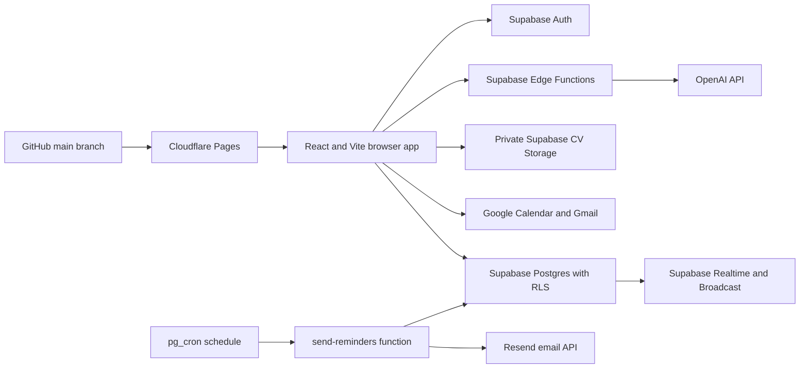

# Opportunity Desk developer handoff

This file is the starting point for the next change to Opportunity Desk. It explains what exists, why it was built this way, where to make changes, and what must be checked before merging.

Last reviewed: 4 August 2026.

## Start here for the next change

1. Read the architecture rules below. Keep React, Supabase, GitHub, and Cloudflare in their current roles.
2. Confirm whether the change needs only browser code or also a database migration or Edge Function.
3. Create a branch named `codex/<short-change-name>` from the latest `main`.
4. Preserve row-level security, multi-device synchronization, and optimistic locking.
5. Test desktop and mobile paths, including failure and retry behavior.
6. Run the verification checklist near the end of this file.
7. Open or update a pull request and address every actionable review finding.

Do not put service-role keys, OpenAI keys, Google access tokens, or other private credentials in browser code, GitHub, or Cloudflare public variables.

## Product purpose

Opportunity Desk is a private job-search workspace at `jobs.ezherebetskii.com`. A person signs in once on any device and sees the same applications, CVs, contacts, interview preparation, reminders, preferences, and history. No device-specific database connection is required.

The main user journey is:

1. Find or manually add an opportunity.
2. Track it through the application pipeline.
3. Select or tailor a CV for that opportunity.
4. Send the application through Gmail and retain synchronized history.
5. Work the relationships around it: recruiters, referrals, and follow-ups.
6. Prepare for each interview against the job description and verified evidence.
7. Schedule follow-ups and receive reminders even when the app is closed.
8. Review what actually produced interviews and decide what to do next.

## Architecture that must remain unchanged



- **React and Vite** render the user interface.
- **Supabase Auth** owns sign-in and sessions.
- **Supabase Postgres** is the single source of truth for synchronized records.
- **Row-level security** limits every user to their own records.
- **Supabase Realtime** refreshes signed-in devices after changes.
- **Supabase Storage** keeps CV files private and separated by user folder.
- **Supabase Edge Functions** hold private third-party API keys and perform protected server work.
- **Google Identity Services** grants short-lived Calendar and Gmail access in the current browser session.
- **pg_cron** triggers scheduled server work; secrets it needs are read from Vault at execution time.
- **GitHub pull requests** provide change history and review.
- **Cloudflare Pages** builds and hosts the browser application.

The browser receives only the public Supabase project URL and publishable key. Those values identify the backend but do not bypass authentication or row-level security.

## Current delivery status

| Phase | Status | Result |
|---|---|---|
| Synchronized foundation | Merged | Baseline `jobs` and `cvs` tables, authentication, RLS, Realtime, and account-based access on every device. |
| Sign-in cleanup | Merged | Users no longer enter or connect Supabase details on new devices. |
| Opportunity Desk rebuild | Merged | Dashboard, board, application table, reminders, settings, backup, restore, and mobile navigation. |
| CV library | Merged | Private uploads, text CVs, editing, download, deletion, and cross-device deletion refresh. |
| CV-to-opportunity links | Merged | Each application can reference the CV used; CVs can record a tailored company; board drag-and-drop is supported. |
| Live job search | Merged | Remotive and Arbeitnow search, pagination, publication dates, one-click saves, and provider duplicate protection. |
| Google workflow | Merged in PR #9 | Calendar events, Gmail sending with the linked CV, per-user OAuth isolation, synchronized send history, and retryable history writes. |
| AI CV tailoring | Merged in PR #10 | Local matching, protected AI drafting, usage limits, complete source-CV preservation, and form-validation safeguards. Add the server secret before production acceptance testing. |
| Networking and interview preparation | Merged in PR #13 | Contact tracker with its own pipeline, interaction history, reminders, STAR story library, and per-application interview preparation. |
| Analytics and server reminders | Merged in PR #14 | Immutable stage-event history, honest counts-first analytics, and an opt-in scheduled email digest of due follow-ups. |

PR #10: <https://github.com/EugeneZherebetsky/ezherebetskii-site/pull/10>
PR #13: <https://github.com/EugeneZherebetsky/ezherebetskii-site/pull/13>
PR #14: <https://github.com/EugeneZherebetsky/ezherebetskii-site/pull/14>

All migrations through `20260804171000` are applied to the production project, and `send-reminders` is deployed. Reminder delivery stays idle until its secrets are configured; see the operational follow-ups near the end of this file.

Professional PDF/DOCX CV output (previously Phase 10) is deferred: CVs and cover letters are being produced in separate tools. Its `job_stage_events` history has been revived in the analytics phase; the remaining `cv_artifacts` slice stays parked unmerged on the `codex/cv-document-foundation` branch.

## Features already implemented

### Authentication and synchronization

- Email/password and email-link authentication.
- No database configuration on the sign-in screen.
- All records are scoped to the signed-in Supabase user.
- Realtime refreshes other signed-in devices.
- Google access is cleared when the Supabase account changes or signs out.

### Opportunity tracking

- Dashboard metrics and follow-up queue.
- Board columns for every status, including `on_hold`.
- Searchable and filterable application table.
- Priority, work mode, salary, source, contacts, job description, notes, dates, and email draft.
- Local-time conversion for `datetime-local` editing.
- Optimistic locking through the `version` column.
- JSON backup/restore and CSV export.
- Mobile navigation exposes every workspace view.

### CV library

- PDF, DOC, DOCX, TXT, and RTF files up to 10 MB.
- Text-only CV records.
- Optional tailored-company field; general CVs remain valid.
- Private storage paths under `<user-id>/<cv-id>/<random-id>-<filename>`.
- Replacement uploads use a random identifier to avoid collisions.
- Failed saves clean up only files uploaded by that operation.
- CV deletion uses a private Realtime Broadcast because filtered Postgres DELETE subscriptions cannot reliably identify the former owner.

### CV assignment

- Applications reference a CV using `jobs.cv_id`.
- The database verifies that the linked CV belongs to the same user.
- Desktop users can drag a CV onto a board card.
- Mobile and keyboard users can use the card selector.

### Job search

- Public Remotive and Arbeitnow feeds.
- Arbeitnow Unix timestamps are converted to readable dates.
- Arbeitnow pagination is followed until enough matching results are found or pages end.
- Provider ID and source are protected by a per-user unique index.
- Existing duplicates were made safe before the unique index was added.

### Google Calendar and Gmail

- The public Google OAuth client ID is saved in synchronized user settings.
- Google access tokens remain in browser memory and are scoped to the current Supabase user.
- Calendar events are created from the application follow-up details.
- Gmail sends the linked private CV as an attachment.
- Successful sends create immutable `application_sends` history.
- If Gmail succeeds but the database write fails, the Gmail message ID is retained in a per-user browser retry queue. Retrying records the existing message and does not send it again.

### AI-assisted CV work

- Free keyword matching runs locally in the browser.
- Sentence punctuation is removed before comparison while meaningful internal technology punctuation is preserved.
- Short skills such as `Go`, `R`, `C#`, `C`, `F#`, `AI`, `ML`, `UI`, and `UX` are supported explicitly.
- CV versions are ranked against the job description.
- The protected `tailor-cv` Edge Function verifies the signed-in user and reads only that user's job and CV.
- OpenAI receives the job description and CV only after the user chooses the AI action.
- OpenAI response storage is disabled and strict structured output is required.
- Untrusted job and CV text is clearly separated from server instructions.
- A private generation ledger limits each user to a configurable rolling 24-hour allowance.
- Generated summaries, highlights, and cover letters remain editable and require human review.
- A saved tailored version contains the generated sections **and the complete source CV**, so a linked text attachment is not reduced to a summary and several bullets.
- Opening the tailoring tool from an application form runs the same native URL, email, and required-field validation as normal saving.

### Networking tracker

- Contacts with relationship type, company, role, email, phone, and profile link.
- A networking pipeline (`to_contact` → `contacted` → `in_conversation` → `meeting_scheduled` → `dormant` → `closed`) separate from application status.
- Contacts can link to an opportunity; the database verifies same-user ownership like `jobs.cv_id`.
- Logged interactions per contact (channel, time, summary). The contact list embeds only each contact's newest interaction time; the full history is loaded per contact when its editor opens, so no account-wide row limit can hide older history.
- A failed interaction insert keeps the typed note in the form so it can be retried.
- Next actions with due dates appear in the Reminders view and in browser notifications alongside application follow-ups.
- Contact, interaction, story, and preparation deletions are broadcast on the private per-user channel because filtered Postgres DELETE subscriptions are unreliable.

### Interview preparation

- A reusable STAR story library (situation, task, action, result, skills, notes); stories must stay factual.
- Applications in `phone_screen`, `interviewing`, `assessment`, or `final_round` appear as upcoming interviews.
- Likely topics are derived locally from the job description with the same keyword normalization used for CV matching; no AI call is involved.
- Saved STAR stories are ranked against the job description so the most relevant evidence is suggested.
- Per-application preparation record: research notes, questions to ask, a fixed preparation checklist, and post-interview notes, all synchronized with optimistic locking.
- One preparation record per application, enforced by a unique index; concurrent creation from two devices resolves to a clear conflict message.
- Preparation saves are locked against the record version the open draft was loaded from, not the latest Realtime state, so a background refresh cannot let a stale draft silently overwrite another device's save.

### Analytics

- `job_stage_events` records immutable application-stage history: a `created` event on insert and a `status_change` event on every status transition, written by a protected trigger.
- Existing applications were backfilled with `backfill_current_state` events whose details mark them as excluded from duration metrics; reaching a state still counts for funnel purposes.
- The Analytics view computes everything client-side: applications per week (by applied date), response/interview/offer rates, a stage funnel of states ever reached, median days from applying to first response (live-recorded events only), results by source and by CV version, and overdue follow-up counts.
- Stage events are fetched in pages because the API caps every request at `max_rows`; a single capped query would silently truncate history. Weekly buckets are matched on calendar week keys, not elapsed milliseconds, so daylight-saving weeks do not shift counts.
- Percentages are never shown without their underlying counts (`shareLabel`), and the view states explicitly that small samples are not predictions.

### Server-delivered reminders

- Opt-in per user in Settings: `email_reminders_enabled` plus a local `email_reminder_hour` interpreted in the user's saved timezone.
- pg_cron invokes the `send-reminders` Edge Function hourly through `net.http_post`; the shared secret is read from Vault (`reminder_cron_secret`) at execution time and verified against the function's `REMINDER_CRON_SECRET`.
- The function runs with the service role, gathers due application and networking follow-ups per opted-in user (lead window from `reminder_lead_hours`, overdue up to 7 days), and sends one digest email through Resend to the account's own address.
- `reminder_deliveries` deduplicates per (user, item, next_action_at); rows are written only after Resend accepts the email, so a failed send retries at the next matching hour instead of being lost.
- If the digest email fails to record its deliveries, the worst case is a repeated digest — never a silently missed reminder.

## Important files

| File | Responsibility |
|---|---|
| `src/App.tsx` | Supabase session lifecycle and clearing Google access when the user changes. |
| `src/components/AuthScreen.tsx` | Sign-in, account creation, and email-link login. |
| `src/components/Workspace.tsx` | Main workspace state, database reads/writes, Realtime subscriptions, board, views, backups, CV links, Google actions, and AI save/link actions. |
| `src/components/JobForm.tsx` | Application editor and native form validation. |
| `src/components/CVForm.tsx` | CV metadata, optional company, text, and file selection. |
| `src/components/JobSearch.tsx` | Search form and vacancy results. |
| `src/components/TailorCV.tsx` | CV selection, local match display, AI drafting, review, copy, save, and cover-letter actions. |
| `src/components/Contacts.tsx` | Networking pipeline summary, contact search and stage filter, and contact cards. |
| `src/components/ContactForm.tsx` | Contact editor with interaction logging and history. |
| `src/components/InterviewPrep.tsx` | Upcoming interviews, likely topics, story ranking, checklist, preparation notes, and the STAR library. |
| `src/components/StarStoryForm.tsx` | STAR story editor. |
| `src/components/Analytics.tsx` | Counts-first analytics view: weekly effort, funnel, response times, sources, and CV performance. |
| `src/lib/supabase.ts` | Browser Supabase client using public environment values. |
| `src/lib/opportunities.ts` | Application conversions, filtering, dates, board columns, CSV, and JSON helpers. |
| `src/lib/cvs.ts` | CV file validation, safe filenames, downloads, and attachment preparation. |
| `src/lib/jobSearch.ts` | Provider requests, pagination, normalization, and result filtering. |
| `src/lib/google.ts` | OAuth access cache, Calendar, Gmail, MIME email creation, and token isolation. |
| `src/lib/tailoring.ts` | Keyword normalization, CV ranking, top-keyword extraction, Edge Function invocation, and saved/copyable text creation. |
| `src/lib/networking.ts` | Contact, interaction, story, and preparation conversions; contact filtering; interview-topic derivation and story ranking. |
| `src/lib/analytics.ts` | Pure analytics functions: reached statuses, funnel, weekly buckets, median response time, grouped outcomes. |
| `src/types.ts` | Shared application, CV, contact, interaction, STAR story, interview-preparation, stage-event, settings, send-history, status, and draft types. |
| `src/lib/*.test.ts` | Vitest unit tests for the pure library logic. Run with `npm test`. |
| `src/styles.css` | Desktop and mobile layout. |
| `../supabase/functions/tailor-cv/index.ts` | Authenticated OpenAI server integration and generation accounting. |
| `../supabase/functions/send-reminders/index.ts` | Cron-invoked reminder digests: secret check, per-user due items, Resend delivery, and dedup records. |
| `../supabase/migrations/` | Replayable database history. Never replace migrations with untracked dashboard-only changes. |

## Database and storage map

| Object | Purpose |
|---|---|
| `public.jobs` | Opportunities, pipeline status, contacts, follow-ups, job description, email draft, CV link, version, and extension data. |
| `public.cvs` | CV metadata, private storage path, extracted/pasted text, tailored company, version, and extension data. |
| `public.user_settings` | Default view, reminders, timezone, public Google OAuth client ID, and email-reminder opt-in with delivery hour. |
| `public.application_sends` | Immutable Gmail send history and provider message ID. |
| `public.ai_generations` | Server-only generation status, model, usage, and rolling-limit accounting. |
| `public.contacts` | Networking contacts, relationship type, pipeline stage, optional opportunity link, next action, version, and extension data. |
| `public.contact_interactions` | Logged conversations per contact with channel, time, and summary. |
| `public.star_stories` | Reusable STAR interview examples with skills and notes. |
| `public.interview_preps` | One preparation record per application: research notes, questions, checklist, and post-interview notes. |
| `public.job_stage_events` | Immutable application-stage history; synthetic backfills are marked for exclusion from duration metrics. |
| `public.reminder_deliveries` | Server-managed log deduplicating sent reminder emails per (user, item, due time); users can read their own rows. |
| Storage bucket `cvs` | Private user-owned CV files. |
| Realtime channel `opportunity-desk:<user-id>` | Private database refresh plus CV-deletion and networking-deletion broadcasts. |

Every editable record uses a positive `version`. Update code must include the expected version and verify that a row was returned.

```ts
const { data, error } = await supabase
  .from('jobs')
  .update(payload)
  .eq('id', job.id)
  .eq('version', job.version)
  .select('id')
  .maybeSingle()

if (error) {
  // Show the database error.
} else if (!data) {
  // Another device changed or deleted the record. Reload and keep user edits open.
}
```

Supabase considers an update that changes zero rows successful, so checking only `error` will silently lose concurrent edits.

## Migration history

| Migration | Purpose |
|---|---|
| `20260802144000_create_job_tracker_tables.sql` | Replayable baseline for `jobs` and `cvs`. |
| `20260802145041_strengthen_job_tracker_foundation.sql` | Typed columns, indexes, version triggers, grants, and RLS policies. |
| `20260802145743_enable_tracker_realtime_sync.sql` | Adds the main tables to Supabase Realtime. |
| `20260802145938_backfill_legacy_job_data.sql` | Converts older JSON records into typed columns. |
| `20260802184658_expand_opportunity_desk.sql` | Adds richer application fields, settings, send history, constraints, and Realtime. |
| `20260802191715_secure_cv_library_storage.sql` | Creates and protects the private CV storage bucket. |
| `20260802193625_broadcast_cv_deletions.sql` | Adds secure CV-deletion Broadcast notifications. |
| `20260802201004_link_opportunities_to_cvs.sql` | Adds tailored company, `jobs.cv_id`, ownership checks, and index. |
| `20260802204918_prevent_duplicate_job_search_saves.sql` | Clears duplicate provider identifiers before adding the unique index. |
| `20260802212315_add_google_integrations.sql` | Adds and validates the synchronized public Google client ID. |
| `20260802215953_add_ai_generation_limits.sql` | Adds the private AI ledger and atomic per-user reservation function. |
| `20260802220355_address_ai_generation_advisors.sql` | Adds foreign-key indexes and an explicit server-managed deny policy. |
| `20260804120000_add_networking_and_interview_prep.sql` | Adds contacts, interactions, STAR stories, interview preparation, ownership checks, deletion broadcasts, and Realtime. |
| `20260804170000_add_job_stage_events.sql` | Adds immutable stage-event history with a recording trigger and marked synthetic backfills. |
| `20260804171000_add_server_reminders.sql` | Adds email-reminder settings, the delivery dedup log, and the hourly pg_cron invocation of `send-reminders`. |

For a schema change:

1. Inspect the current schema and existing migration order.
2. Create a new migration; do not edit a migration that has already run remotely.
3. Make existing data safe before adding stricter constraints or unique indexes.
4. Add RLS, grants, ownership checks, foreign keys, and supporting indexes.
5. Apply the migration through the configured Supabase workflow.
6. Confirm the remote migration version matches the local filename.
7. Run Supabase security and performance advisors.
8. Confirm a fresh database can replay the entire migration directory in order.

## Review-proven engineering rules

These rules come from defects already found during review. Treat them as regression requirements.

1. **Migration history must start from an empty database.** A migration cannot alter a table that an earlier migration did not create.
2. **Check zero-row updates.** Optimistic-lock conflicts do not automatically appear as Supabase errors.
3. **Convert stored UTC values for local inputs.** Do not slice an ISO timestamp directly into `datetime-local`.
4. **Represent every status in every navigation view.** An `on_hold` record must not disappear from the board.
5. **Keep every view reachable on mobile.** Do not hide functionality without a mobile alternative.
6. **Preserve extension data during backup restore.** The `data` JSON column must round-trip unchanged.
7. **Use Broadcast for filtered deletions.** Postgres Changes filters are not dependable for DELETE ownership columns.
8. **Make uploads collision-proof.** Use a random path component and clean up only an upload that this operation completed.
9. **Keep nullable business fields optional.** A general CV must not require a fictional tailored company.
10. **Normalize external provider data.** Convert numeric timestamps and follow pagination.
11. **Clean existing data before stricter indexes.** Never let an upgrade fail because historic duplicates exist.
12. **Scope OAuth tokens to the signed-in user.** Clear cached Google access on every account transition.
13. **Keep a retry path after irreversible external actions.** A sent email must still be recordable if synchronization temporarily fails.
14. **Never save an incomplete attachment as a CV.** AI-tailored versions must retain the full source content.
15. **Normalize matching text before scoring.** Terminal punctuation and short skills must not distort ranking.
16. **Run complete form validation on alternate actions.** A non-submit button must not bypass URL, email, or required-field validation before saving.
17. **Lock against the version the open draft was loaded from.** A Realtime refresh must never raise the expected version underneath unsaved edits; otherwise a stale draft passes the optimistic-lock check and silently overwrites another device.
18. **Keep user input after a failed write.** Clear a form field only once the handler confirms the record was saved. A resolved promise is not evidence of success.
19. **Never request more rows than `api.max_rows`.** A `.limit()` above the configured cap is silently truncated; page with `.range()` until a short page arrives. With ascending order the truncation hides the newest data, which is usually the data that matters.
20. **Bucket calendar periods by calendar keys.** Daylight-saving weeks are 167 or 169 hours long, so dividing elapsed milliseconds by a fixed week misassigns every bucket after a transition.

## Environment and secrets

### Browser environment

Create `.env.local` from `.env.example`:

```text
VITE_SUPABASE_URL=https://<project>.supabase.co
VITE_SUPABASE_PUBLISHABLE_KEY=<public-publishable-key>
```

Only variables intentionally prefixed with `VITE_` are included in the browser build. Never use that prefix for a private key.

### Supabase Edge Function secrets

Configure private values in Supabase Edge Functions, not in the repository:

- `OPENAI_API_KEY` — required for paid AI generation.
- `OPENAI_MODEL` — optional; current default is `gpt-5.6-sol`.
- `AI_DAILY_LIMIT` — optional; current default is 10 requests per rolling 24 hours.
- `ALLOWED_ORIGINS` — optional comma-separated additional browser origins.
- `RESEND_API_KEY` — required for reminder-digest email delivery through Resend.
- `REMINDER_CRON_SECRET` — required; shared secret the `send-reminders` function demands from its cron caller.
- `REMINDER_FROM_EMAIL` — optional sender; defaults to `Opportunity Desk <onboarding@resend.dev>`, which Resend only delivers to the account owner's address until a domain is verified.

The reminder schedule also needs a Vault secret named `reminder_cron_secret` (Dashboard → Database → Vault) holding the same value as `REMINDER_CRON_SECRET`; pg_cron reads it at execution time so no secret is stored in the migration.

The `tailor-cv` function performs its own Supabase user verification. Its gateway JWT check is disabled so browser preflight requests work, but the function must continue rejecting missing or invalid bearer sessions itself.

### Google configuration

- The Google OAuth client ID is public and is saved in `user_settings`.
- Google access tokens are private, short-lived, and browser-memory only.
- Never persist a Google access token in Supabase, local storage, logs, or a backup.

## Safe implementation workflow

### 1. Define the behavior

Write down:

- the user action;
- the expected synchronized result;
- what happens on another device;
- what happens when the network or provider fails;
- whether the action can be retried safely;
- the mobile and keyboard path.

### 2. Decide where the logic belongs

- Use the browser for display, local filtering, public feeds, and user-approved Google actions.
- Use Postgres for durable synchronized state and constraints.
- Use RLS for ownership boundaries.
- Use Storage for private files.
- Use an Edge Function for private API keys, server-side rate limits, or protected third-party calls.

### 3. Implement database changes first

Add a replayable migration and verify ownership, indexes, cleanup of existing data, and deletion behavior before wiring the UI.

### 4. Implement failure-safe browser behavior

- Keep forms open when a save fails.
- Preserve unsaved user input after conflicts.
- Verify affected rows after versioned updates.
- Do not remove an old file until the new database record is safely committed.
- Preserve provider IDs for retry after an irreversible external action succeeds.

### 5. Verify before publishing

From `jobs-app`:

```sh
npm test
npm run build
npm audit --audit-level=high
```

Also verify:

- the specific regression scenario for the change;
- desktop and mobile layout;
- keyboard access and form validation;
- signed-out behavior;
- cross-device refresh;
- RLS ownership with two different users when possible;
- fresh migration replay;
- Supabase security and performance advisors;
- Edge Function authentication, CORS, missing-secret behavior, and provider failure behavior;
- no private key or secret-shaped value is staged.

### 6. Publish through GitHub

1. Stage only files belonging to the change.
2. Leave unrelated local files untouched.
3. Commit with a behavior-focused message.
4. Push the `codex/...` branch.
5. Open or update the pull request with implementation and verification notes.
6. Fetch unresolved review threads, implement every selected finding, and rerun verification.
7. Do not mark review threads resolved unless explicitly asked; let the reviewer confirm when appropriate.

## Known operational follow-ups

Completed on 4 August 2026: the remote migration history was repaired to include the pre-tracking baseline `20260802144000`, all pending migrations through `20260804171000` were applied, and `send-reminders` was deployed.

Still open:

- Configure the reminder secrets before email digests can send: `RESEND_API_KEY` and `REMINDER_CRON_SECRET` as Edge Function secrets, plus a Vault secret named `reminder_cron_secret` holding the same value. Until then the hourly job runs and receives a "not configured" response, which is the intended idle state.
- Add `OPENAI_API_KEY` to Supabase Edge Function secrets before live AI acceptance testing.
- Perform an authenticated production test of matching, AI drafting, full-CV saving, linking, Gmail attachment creation, and cross-device refresh.
- Enable Supabase leaked-password protection in the Auth security settings. This is an existing security-advisor warning, not a code migration.
- Run the Supabase security and performance advisors now that the networking, stage-event, and reminder tables exist.
- Verify the first reminder digest end to end once the secrets are set: check the cron run, the function response, the received email, and the `reminder_deliveries` rows.
- Confirm the Cloudflare production deployment after each merge.

## Recommended next improvements

The improvements below are ordered by practical value to an active job search.

The last two phases added a great deal of data — contacts, interactions, STAR stories, preparation records, and stage history — but each view still shows only its own slice. Interface work now returns more than new features, so it comes first.

## Interface improvements

### 1. Opportunity detail view with a stage timeline — recommended next

**Why it helps:** An opportunity now has a linked CV, contacts, interview preparation, send history, and stage history, yet nothing shows them together. The application editor is a single modal that already carries opportunity fields, progress, an email draft, AI actions, Google actions, and send history; it is the most crowded surface in the product and it still cannot show the related records.

Suggested scope:

- a routed detail view per application, replacing the modal as the primary editing surface;
- tabs or sections for details, preparation, people, and history;
- a visual timeline built from `job_stage_events`, which is already recorded but never displayed;
- linked contacts and the interview preparation record shown inline, with links back to their own views;
- send history and the CV actually attached;
- keep the quick modal for creating a record, so adding an opportunity stays fast.

### 2. A dashboard that reflects the whole workspace

**Why it helps:** The dashboard still only knows about applications. It does not show networking follow-ups, upcoming interviews, or any sense of weekly progress, so the first screen after sign-in is no longer the most useful one.

Suggested scope:

- one "today" list merging application and networking follow-ups;
- upcoming interviews with their preparation completeness;
- this week's activity against a target;
- recent stage changes as an activity feed;
- quick actions for adding an opportunity, contact, or interaction.

### 3. Global search and quick actions

**Why it helps:** Records now live in five separate views. Finding one means guessing which view holds it and using that view's own search box.

Suggested scope:

- one search across applications, contacts, CVs, and STAR stories;
- keyboard-first opening and result navigation;
- direct actions from results, such as opening an application or logging an interaction;
- a small set of shortcuts for the most frequent actions.

### 4. Navigation that scales past eleven views

**Why it helps:** The sidebar lists eleven destinations and the mobile strip scrolls horizontally through all of them. Both will keep growing.

Suggested scope:

- group navigation into pipeline, people, preparation, documents, and insights;
- on mobile, show the few most-used destinations with an overflow menu;
- remember the last view per device while keeping the synchronized default start page.

### 5. Interface debts worth clearing

**Why they help:** Each is small on its own, but together they decide whether daily use feels solid.

- Bulk selection in the applications table for status changes, exports, and deletion.
- Richer filtering: priority, work mode, source, date ranges, and saved filter presets.
- A dark theme.
- Errors and notices are currently one banner at the top of the workspace; make failures visible next to the action that failed.
- An accessibility pass on modals: focus trapping, restoring focus on close, `aria-live` announcements for banners, and full keyboard paths for drag-and-drop alternatives.
- Consider an installable progressive web app so the workspace opens like an application on phones.

## Feature improvements

### 6. Gmail reply and thread tracking

**Why it helps:** Recruiter replies arrive in Gmail and are copied into the tracker by hand. Thread identifiers are already stored in `application_sends.details`, so most of the groundwork exists.

Suggested scope:

- request only the minimum additional Gmail read permission;
- let the user refresh a specific thread rather than continuously reading the mailbox;
- show the reply alongside the application and suggest, but never automatically apply, a status change;
- record the first reply as a response event so response-time analytics stop depending on manual status updates;
- never expose one user's Google data after a Supabase account transition.

### 7. Saved searches and a daily vacancy digest

**Why it helps:** Repeating the same searches manually consumes time and causes good vacancies to be missed.

Suggested scope:

- save keywords, location, remote preference, and providers;
- run searches on a schedule through a server-side function;
- deduplicate against saved opportunities;
- show a “new since last check” inbox;
- optionally send one daily summary rather than many notifications;
- track provider errors and pagination limits.

The scheduling and digest-email infrastructure already exists from the reminder phase: an hourly pg_cron job, a Vault-held shared secret, an Edge Function pattern, and a delivery-deduplication table. Extend that pattern rather than adding a second schedule.

### 8. Weekly targets and a review ritual

**Why it helps:** Analytics reports what happened but sets no expectation. A target turns the numbers into a decision about the coming week. This is the one part of the original analytics scope that was not delivered.

Suggested scope:

- synchronized weekly targets for applications sent and outreach messages;
- progress against target on the dashboard, not only in Analytics;
- a weekly summary covering what was sent, what advanced, and what slipped;
- optionally attach that summary to the existing reminder digest rather than sending a second email;
- keep targets private guidance, never a score or a streak that punishes a quiet week.

### 9. Companies as first-class records

**Why it helps:** Company is a free-text string on applications, contacts, and CVs. Nothing connects three applications to the same employer, or a recruiter to the role they are hiring for, and every analytics grouping inherits the inconsistency of typed names.

Suggested scope:

- a company record with name, site, notes, and normalized matching for existing free text;
- applications, contacts, and interview research linked to it;
- one page showing everything about an employer: roles applied for, people involved, and history;
- careful backfill that groups existing spellings without destroying the original values.

### 10. Complete backup coverage

**Why it helps:** Backup and restore still cover applications only. Contacts, interactions, STAR stories, and interview preparation now hold a great deal of irreplaceable work that exists in exactly one place.

Suggested scope:

- extend the JSON backup to every user-owned table, with a version marker;
- preserve each `data` JSON column unchanged, as the current restore already does;
- restore with the same optimistic-lock and ownership checks used elsewhere;
- state clearly in the interface what is and is not included, including CV files.

### 11. Outreach message templates

**Why it helps:** The networking phase deliberately left this open. Introductions, thank-you notes, and follow-ups are rewritten from scratch each time.

Suggested scope:

- reusable templates with placeholders for person, company, and role;
- insert into the application email draft or copy for LinkedIn;
- one-click logging of the resulting interaction;
- a small starter set covering introduction, thank-you, and check-in.

### 12. AI assistance for interview preparation

**Why it helps:** The other half of the deferred interview scope. Likely topics are currently keyword-derived; a model could turn them into practice questions and help shape existing evidence.

Suggested scope:

- generate likely questions from the job description through the existing protected Edge Function pattern;
- reorganize verified STAR stories toward a specific role;
- never invent experience: every generated sentence must trace to a saved story, and the interface must say so;
- reuse the existing per-user generation ledger and rolling limit.

### 13. Stronger CV-to-job matching

**Why it helps:** The current score is deliberately a simple keyword-overlap guide.

Suggested scope:

- multi-word phrases and skill aliases;
- weighted required versus preferred qualifications;
- transparent explanations for every matched or missing term;
- user-confirmed synonyms and transferable skills;
- skill-gap learning plan;
- no “chance of hire” claim or opaque ATS prediction.

### 14. More job providers through a protected search service

**Why it helps:** More sources expand coverage, but private provider keys and quotas cannot live in the browser.

Suggested scope:

- server-side adapters for providers such as Adzuna;
- normalized result format;
- caching, pagination, quotas, and provider-specific errors;
- the same per-user duplicate protection already used for Remotive and Arbeitnow.

## Deferred scope

### Professional PDF and DOCX output

**Deferred by decision on 4 August 2026:** CVs and cover letters are produced in separate tools, so in-app document generation is not planned. The scope is kept here in case that decision changes, and the unmerged foundation branch `codex/cv-document-foundation` still holds a `cv_artifacts` catalog with storage cleanup.

Original scope: extract editable text from uploaded PDF and DOCX files, add reusable layouts, preview a tailored CV, export PDF and DOCX into the private bucket, attach the generated document in Gmail instead of a plain-text fallback, retain source and generation metadata, and provide a final review checklist. Document generation would stay behind the current architecture, with no private conversion-service keys in the browser.

## Suggested roadmap

Delivered so far: networking and interview preparation (PR #13), then analytics and server reminders (PR #14). Professional CV output remains deferred.

1. **Phase 14: Opportunity detail and workspace navigation** — a routed detail view with the stage timeline, a dashboard covering the whole workspace, and global search. This is the largest gap between what the data model knows and what the interface shows.
2. **Phase 15: Gmail reply and thread tracking** — the biggest remaining reduction in manual work, and it makes response-time analytics trustworthy without relying on manual status updates.
3. **Phase 16: Saved searches and a daily vacancy digest** — reuses the pg_cron and digest-email infrastructure that already exists.
4. **Phase 17: Targets, companies, and complete backup** — closes the analytics loop, gives grouping a stable key, and removes the remaining data-loss risk.

This order fixes how existing work is seen and acted on, then reduces manual maintenance, then widens the funnel, and finally strengthens the record itself.

## Definition of done for any future phase

A phase is complete only when:

- the browser experience works on desktop and mobile;
- all durable data synchronizes across devices;
- RLS and storage ownership are verified;
- concurrent edits cannot be silently lost;
- destructive and irreversible actions have clear confirmation or recovery;
- migrations replay from an empty database;
- private keys remain server-side;
- build, audit, regression, and advisor checks pass;
- the pull request explains setup and deployment requirements;
- production behavior is verified after merge.
